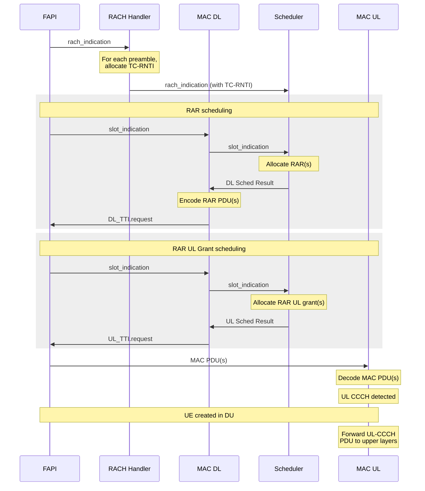

# MAC Procedures

This document describes the runtime procedures driven by the MAC. For the MAC's architecture,
interfaces and data paths, see [README.md](README.md).

## RA Procedure

The Random Access procedure is handled primarily by the DU MAC in the following steps:

1. The RACH handler manages the allocation of temporary RNTIs (TC-RNTIs) for each of the detected PRACH preambles in a given slot, and forwarding of these preambles and TC-RNTIs to the scheduler.
2. The scheduler is then responsible for allocating the RAR and Msg3 grant for each detected PRACH preamble.
3. The MAC DL processor has the role of encoding the MAC DL PDUs sent to FAPI.

This leads to the following messaging flow graph:

It is worth noting that the creation of a new UE in the DU is deferred until Msg3 is received. This design has the following advantages:

- UE Resources are not allocated unnecessarily for the cases when a phantom PRACH is detected, the UE fails to detect the RAR, or the Msg3 is not correctly decoded by the gNB.
- UE Resources are allocated after the RAR window has passed. With this design, any latency in the UE resource allocation thus won’t affect the ability of the scheduler to timely schedule RARs. Notice that the RAR window in NR can be relatively short, depending on the type of service provided.
